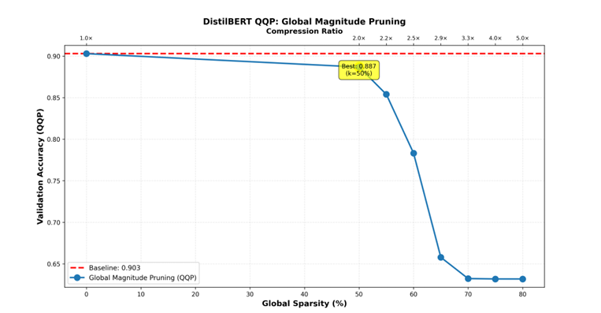
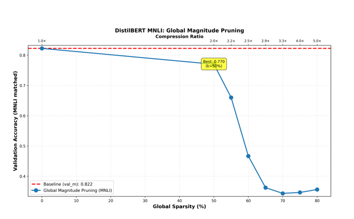

# Magnitude-Based Pruning for Transformer Models

A comprehensive investigation into magnitude-based pruning techniques for DistilBERT transformer models, demonstrating efficient compression strategies for deployment on resource-constrained devices.

## 📋 Table of Contents
- [Overview](#overview)
- [Key Findings](#key-findings)
- [Installation](#installation)
- [Quick Start](#quick-start)
- [Experiments](#experiments)
- [Results](#results)

## 🎯 Overview

This project investigates magnitude-based pruning on DistilBERT across three GLUE benchmark tasks:
- **SST-2**: Binary sentiment classification
- **QQP**: Quora Question Pairs (paraphrase detection)
- **MNLI**: Multi-Genre Natural Language Inference

We explore sparsity levels from 50% to 80%, comparing **global pruning** vs. **layer-wise pruning** strategies to identify optimal compression-accuracy trade-offs.

### Problem Statement
Large transformer models are computationally expensive and memory-intensive, making deployment on edge devices challenging. We investigate whether simple magnitude-based pruning can achieve significant compression (4×–8×) while maintaining acceptable accuracy.

## 🔑 Key Findings

### Three-Phase Pruning Pattern
All experiments revealed a consistent three-phase behavior:
1. **Safe zone at moderate sparsity** (0-50%): Minimal accuracy degradation
2. **Knee/tipping point** (55-60%): Accuracy begins sharp decline
3. **Over-pruning region** (>70%): Severe performance degradation

### Optimal Compression Point
- **50% sparsity** achieves **2× compression** with minimal accuracy loss across all tasks
- **Global pruning** consistently outperforms layer-wise pruning, especially on complex tasks (MNLI)

### Task-Specific Summary

| Dataset | Task Type | Baseline Acc | 50% Sparsity | 80% Sparsity | Optimal Point |
|---------|-----------|--------------|--------------|--------------|---------------|
| **SST-2** | Binary Sentiment | 90.83% | 88.42% (↓2.41%) | 75.46% (↓15.37%) | 50% → 2× compression |
| **QQP** | Paraphrase Detection | 90.29% | 88.26% (↓2.03%) | 63.21% (↓27.08%) | 50% → 2× compression |
| **MNLI** | NLI (3-way) | 82.21% | 76.16% (↓6.08%) | 34.10% (↓48.14%) | 50% → 2× compression |

## 📊 Results

### Global Pruning Performance

#### SST-2 Dataset Results

*Figure 1: DistilBERT global pruning performance on SST-2 showing test accuracy versus sparsity percentage (bottom axis) and compression ratio (top axis). The blue dashed line indicates baseline accuracy.*

**Key Observations:**
- **Safe zone**: Accuracy drops slightly from 0.91 to 0.88 even after removing 50% of weights
- **Tipping point**: Around 60-65% sparsity, accuracy falls to 0.84-0.82
- **Over-pruning**: Beyond 70% sparsity, accuracy falls to mid-0.7s

#### QQP Dataset Results

*Figure 2: DistilBERT global pruning performance on QQP showing test accuracy versus sparsity percentage (bottom axis) and compression ratio (top axis). The red dashed line indicates baseline accuracy, and the yellow highlight marks the optimal point at 50% sparsity.*

**Key Observations:**
- **Safe zone**: Accuracy remains high from 0.90 to 0.89 at 50% and 0.88 at 55%
- **Tipping point**: Around 60% sparsity, accuracy drops to high-0.7s
- **Over-pruning**: Beyond 65%, accuracy continues down toward 0.63

#### MNLI Dataset Results

*Figure 3: DistilBERT global pruning performance on MNLI showing test accuracy versus sparsity percentage (bottom axis) and compression ratio (top axis). The red dashed line indicates baseline accuracy, and the yellow highlight marks the optimal point at 50% sparsity.*

**Key Observations:**
- **Most sensitive task**: Accuracy decreases from 0.82 to 0.77 at 50% sparsity
- **Tipping point**: Around 55-60% sparsity, curve drops steeply to low-0.6 range
- **Over-pruning**: After 60%, accuracy collapses toward high-0.3s

### Layer-wise Pruning Performance

#### SST-2 Dataset Results

**Table 1: Baseline Performance - SST2 Dataset**
| Model | Accuracy (%) | Compression (×) |
|-------|--------------|-----------------|
| Baseline | 90.83 | 1.0 |

**Table 2: Layer-wise Pruning Results - SST2 Dataset**
| Sparsity (%) | Accuracy (%) | Drop (%) | Compression (×) |
|--------------|--------------|----------|-----------------|
| 50 | 88.42 | 2.41 | 2.0 |
| 60 | 83.38 | 7.45 | 2.5 |
| 70 | 80.62 | 10.21 | 3.3 |
| 80 | 75.46 | 15.37 | 5.0 |

**Analysis:** SST-2 demonstrates robust performance under layer-wise pruning. At 50% sparsity, only 2.41% accuracy drop with 2× compression. The tipping point occurs around 70% sparsity.

#### QQP Dataset Results

**Table 3: Baseline Performance - QQP Dataset**
| Model | Accuracy (%) | Compression (×) |
|-------|--------------|-----------------|
| Baseline | 90.29 | 1.0 |

**Table 4: Layer-wise Pruning Results - QQP Dataset**
| Sparsity (%) | Accuracy (%) | Drop (%) | Compression (×) |
|--------------|--------------|----------|-----------------|
| 50 | 88.26 | 2.03 | 2.0 |
| 60 | 72.20 | 18.09 | 2.5 |
| 70 | 63.19 | 27.10 | 3.3 |
| 80 | 63.21 | 27.08 | 5.0 |

**Analysis:** QQP shows moderate resilience at 50% sparsity with only 2.03% drop. Sharp degradation occurs between 50-60% sparsity. Performance plateaus around 63% at 70-80% sparsity.

#### MNLI Dataset Results

**Table 5: Baseline Performance - MNLI Dataset**
| Model | Accuracy (%) | Compression (×) |
|-------|--------------|-----------------|
| Baseline | 82.21 | 1.0 |

**Table 6: Layer-wise Pruning Results - MNLI Dataset**
| Sparsity (%) | Accuracy (%) | Drop (%) | Compression (×) |
|--------------|--------------|----------|-----------------|
| 50 | 76.16 | 6.08 | 2.0 |
| 60 | 42.09 | 40.15 | 2.5 |
| 70 | 34.62 | 47.62 | 3.3 |
| 80 | 34.10 | 48.14 | 5.0 |

**Analysis:** MNLI exhibits highest sensitivity to pruning due to task complexity. Performance collapses dramatically after 60% sparsity, confirming that NLI requires more model capacity.

### Global vs. Layer-wise Comparison

**Key Insight:** Global pruning consistently achieves better accuracy-compression trade-offs than layer-wise pruning across all datasets, especially on complex tasks like MNLI.

**Why Global Pruning Wins:**
- Ranks all weights across entire network
- Allows sensitive layers to retain more parameters
- Aggressively prunes redundant layers
- Avoids over-pruning critical bottleneck layers

**Why Layer-wise Lags:**
- Enforces same sparsity rate in every layer
- Can over-prune critical layers
- Can under-prune redundant layers

## 🛠️ Installation

### Prerequisites
- Python 3.8+
- CUDA-capable GPU (recommended)

### Setup
```bash
# Clone the repository
git clone https://github.com/Nithya162/transformer-magnitude-pruning.git
cd transformer-magnitude-pruning

# Create virtual environment
python -m venv venv
source venv/bin/activate  # On Windows: venv\Scripts\activate

# Install dependencies
pip install -r requirements.txt
```

### Dependencies
```txt
torch>=1.9.0
transformers>=4.20.0
datasets>=2.0.0
scikit-learn>=0.24.0
numpy>=1.21.0
matplotlib>=3.4.0
tqdm>=4.62.0
```

## 🚀 Quick Start

### Run Complete Pipeline (SST-2)
```bash
python final_code.py
```

This will:
1. Train baseline DistilBERT model (or load if exists)
2. Apply magnitude-based pruning from 50% → 80% sparsity
3. Evaluate at multiple sparsity levels (50%, 55%, 60%, 65%, 70%, 75%, 80%)
4. Generate visualization plots

### Run Specific Experiments

#### Global Pruning on SST-2
```bash
python experiments/global_pruning_sst2.py --sparsity 0.5 --epochs 4
```

#### Layer-wise Pruning on MNLI
```bash
python experiments/layerwise_pruning_mnli.py --sparsity 0.6 --epochs 4
```

#### Evaluate Pretrained Pruned Model
```bash
python evaluate.py --model_path ./models/pruned_sst2_50 --dataset sst2
```

## 🧪 Experiments

### 1. Global Magnitude Pruning
Prunes the smallest weights globally across all layers:
```bash
python experiments/global_pruning.py \
    --dataset sst2 \
    --sparsity_range 0.5 0.8 \
    --step 0.05 \
    --pruning_epochs 4
```

**Method:**
- Rank all weights in Linear layers (except classifier) by absolute magnitude
- Pool weights across entire network
- Set smallest weights to zero globally until target sparsity reached
- Gradually increase sparsity from 50% → 80% over 4 fine-tuning epochs

### 2. Layer-wise Magnitude Pruning
Applies uniform sparsity to each layer independently:
```bash
python experiments/layerwise_pruning.py \
    --dataset qqp \
    --sparsity_levels 0.5 0.6 0.7 0.8 \
    --fine_tune_epochs 4
```

**Method:**
- Apply same sparsity percentage to each layer independently
- Maintain balanced parameter distribution across network depth
- Remove smallest magnitude weights within each layer

### 3. Comparative Analysis
Compare global vs. layer-wise pruning:
```bash
python experiments/compare_strategies.py --datasets sst2 qqp mnli
```

### Configuration Options
```python
# config.py
MAX_SEQ_LENGTH = 128
BATCH_SIZE = 32
LEARNING_RATE = 2e-5
SPARSITY_SCHEDULE = "polynomial"  # or "linear"
PRUNING_EPOCHS = 4
INITIAL_SPARSITY = 0.50
FINAL_SPARSITY = 0.80
```

## 📈 Detailed Analysis

### Task Complexity Impact
The results reveal that **task complexity significantly influences** pruning effectiveness:

1. **Simple tasks (SST-2)**: Binary sentiment classification tolerates higher pruning levels
2. **Moderate tasks (QQP)**: Paraphrase detection shows intermediate sensitivity
3. **Complex tasks (MNLI)**: 3-way NLI requires more parameters to maintain performance

### Practical Recommendations

**For Deployment:**
- **Use 50% sparsity** as the sweet spot for 2× compression with minimal accuracy loss
- **Choose global pruning** over layer-wise for better accuracy retention
- **Avoid >60% sparsity** to prevent sharp accuracy degradation
- **Consider task complexity** when setting sparsity targets

**For Research:**
- SST-2: Can push to 70% sparsity with acceptable loss
- QQP: Stay below 60% sparsity
- MNLI: Keep at or below 50% sparsity

### Limitations & Future Work

**Current Limitations:**
1. Focus on unstructured magnitude pruning only
2. Evaluation limited to DistilBERT architecture
3. No runtime/energy measurements on actual edge devices
4. SNIP/GraSP/Fisher comparison incomplete

**Future Directions:**
1. Combine with structured sparsity (pruning entire heads/neurons)
2. Test on larger models (BERT-base, BERT-large) and multilingual transformers
3. Measure actual inference latency and memory on edge devices (Raspberry Pi, Jetson)
4. Integrate with quantization and knowledge distillation
5. Complete gradient-based pruning comparisons (SNIP, GraSP, Fisher)


## 🔗 Related Work

- [Layer-wise Relevance Propagation Compression Framework](https://github.com/Nithya162/LRP-guided-Clustering-Compression-Framework-for-Memory-Constrained-Devices) - Accepted at HiPC 2025
- [Neural Network Interpretability via LRP](https://github.com/Nithya162/Layer-wise-Relevance-Propagation-LRP-)
- [Amazon Fine Food Reviews Sentiment Analysis](https://github.com/Nithya162/Amazon-Fine-Food)

---
